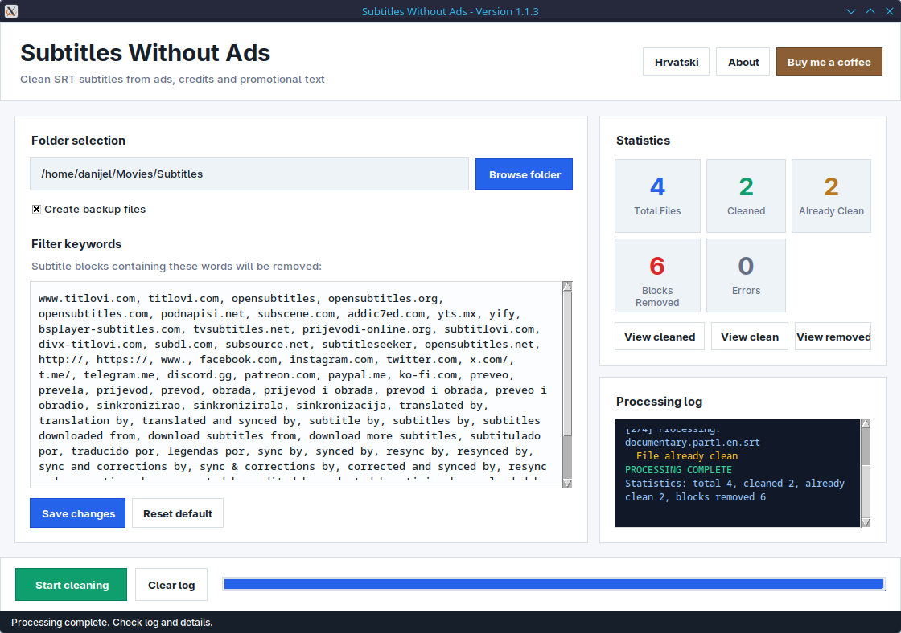
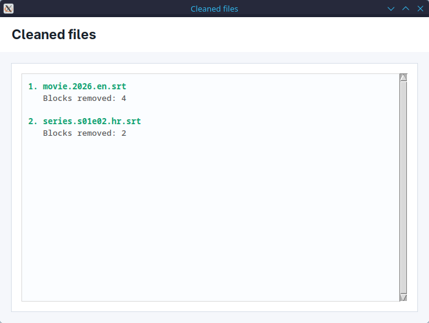
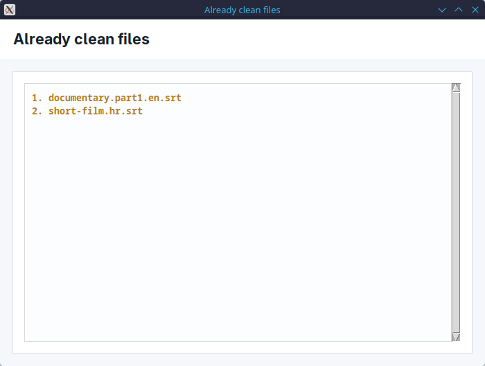
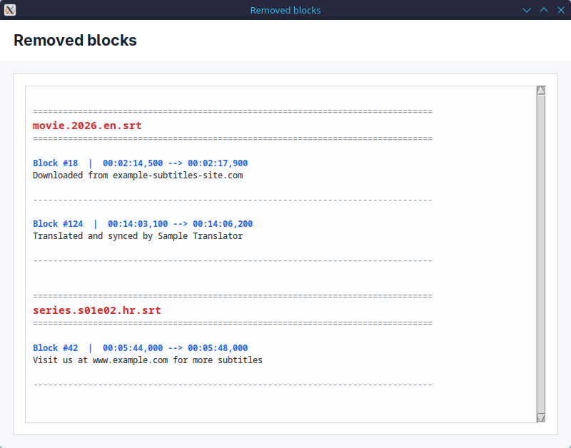
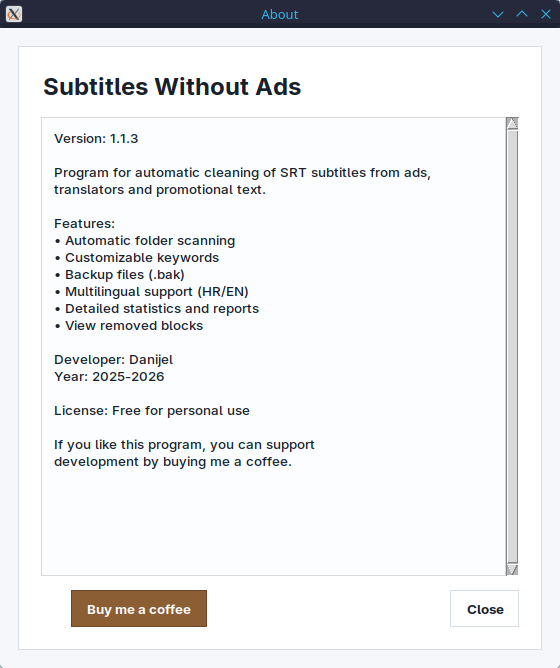

# Subtitles Without Ads

A small Tkinter tool for automatically cleaning `.srt` subtitle files from ads, translator credits, and promotional text.

## Screenshots

### Main window



### Detail views

#### Cleaned files



#### Already clean files



#### Removed blocks



#### About



## Run

Linux/macOS:

```sh
./run_subtitles_without_ads.sh
```

Windows:

```bat
run_subtitles_without_ads.bat
```

Directly with Python:

```sh
python3 subtitles_without_ads.py
```

## Build Packages

Linux build:

```sh
python3 scripts/build_release.py
```

The script creates artifacts in `release/`:

- Linux `.tar.gz`
- Linux `.deb`
- Linux AppImage, if `appimagetool` is available

Windows `.exe` builds on Windows:

```bat
build_windows_exe.bat
```

## Note

Before processing a large subtitle collection, test the program on copies of a few subtitle files. The default keywords are intentionally specific so normal dialogue is not removed by accident.
